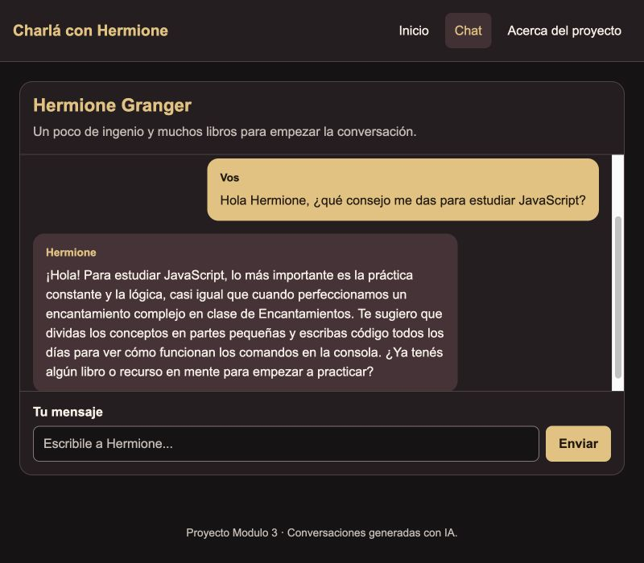
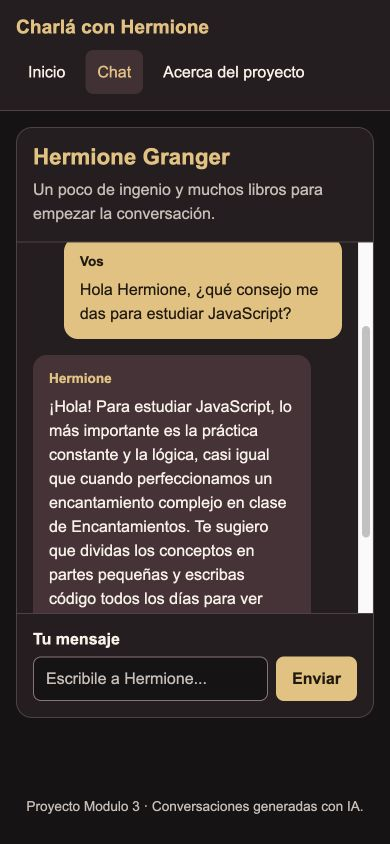
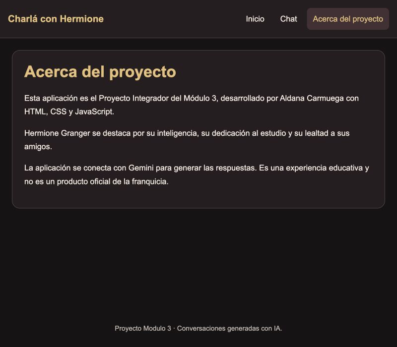

# Charlá con Hermione Granger

[Abrir el chat de Hermione](https://proyectom3-aldanacarmuega.vercel.app/chat)

## Descripción del personaje elegido

Hermione Granger es un personaje del universo de Harry Potter que se destaca por su inteligencia, curiosidad, dedicación al estudio y lealtad a sus amigos. La aplicación interpreta su personalidad mediante Gemini, con respuestas breves en español y referencias a Hogwarts.

## Requisitos y pasos para ejecutar localmente

Se necesita Node.js, npm, una cuenta de Vercel y una API key de Gemini con acceso y cuota para el modelo configurado. El entorno utilizado fue Node.js 24.18.0 y npm 11.16.0.

1. Clonar el repositorio y entrar en la carpeta:

```bash
git clone https://github.com/carmuegaaldana/ProyectoM3-CarmuegaAldana.git
cd ProyectoM3-CarmuegaAldana
```
2. Instalar las dependencias:

```bash
npm install
```

3. Crear `.env` a partir de `.env.example`, si todavía no existe:

```bash
cp -n .env.example .env
```

4. Completar `.env` con la clave personal y el modelo:

```dotenv
GEMINI_API_KEY=tu_clave_personal
GEMINI_MODEL=gemini-3.5-flash-lite
```

La clave real se guarda solo en `.env`, que está excluido de Git. `.env.example` debe permanecer sin credenciales.

5. Iniciar sesión en Vercel:

```bash
npx vercel login
```

6. Ejecutar la aplicación y las funciones del servidor:

```bash
npx vercel dev
```

En la primera ejecución, vincular la carpeta con un proyecto propio de Vercel, aceptar la raíz `./` y mantener la configuración de `vercel.json`. Abrir la dirección que aparece junto a `Ready!`, normalmente `http://localhost:3000`.

Mantener la terminal abierta mientras se usa la aplicación. Para detenerla, presionar Control + C. Reiniciar el servidor después de cambiar `.env`. `npm run dev` ejecuta únicamente el frontend; para probar Gemini se utiliza `npx vercel dev`.

## Cómo ejecutar tests

Desde la raíz del proyecto:

```bash
npm test
```

Los cinco tests de `tests/functions.test.js` comprueban mensajes vacíos, extracción de respuestas, envío del historial, error 503 y respuestas sin texto. Usan `fetch` simulado y variables ficticias, sin consumir la API. Los cinco tests pasaron. También se comprobó el chat con Gemini real en la aplicación desplegada.

## Cómo desplegar a Vercel

1. Subir el proyecto a un repositorio de GitHub sin incluir `.env`.
2. En Vercel, importar el repositorio y seleccionar la raíz `./`.
3. Mantener las opciones de `vercel.json`: preset Vite, Build Command `npm run build` y Output Directory `dist`.
4. Agregar las variables `GEMINI_API_KEY` y `GEMINI_MODEL` en el entorno de producción de Vercel. No usar el prefijo `VITE_` para la clave.
5. Desplegar la aplicación.
6. Probar `/home`, `/chat` y `/about`, incluyendo recargas directas, navegación atrás/adelante y una conversación real de varios turnos.
7. Si se modifican variables de entorno, realizar un nuevo despliegue.

Para desplegar desde la terminal, después de iniciar sesión y vincular el proyecto con Vercel, ejecutar:

```bash
npx vercel --prod
```

La aplicación se publicó el 30 de septiembre de 2026. Se verificaron las vistas, las recargas y una conversación real con Gemini, incluyendo el recuerdo del nombre y del tema de estudio durante la sesión. El historial se mantiene en memoria y se reinicia al recargar la aplicación.

## Capturas de pantalla de la aplicación funcionando

Capturas de la aplicación publicada en Vercel, tomadas el 30 de septiembre de 2026.

**Inicio**


**Chat con una respuesta real de Gemini**



**Chat en pantalla móvil (390 × 844)**



**Acerca del proyecto**



## Link a la aplicación desplegada

- [Abrir la aplicación](https://proyectom3-aldanacarmuega.vercel.app)
- [Ir directamente al chat](https://proyectom3-aldanacarmuega.vercel.app/chat)
- [Repositorio en GitHub](https://github.com/carmuegaaldana/ProyectoM3-CarmuegaAldana)

## Registro del uso de AI en el proyecto

Se utilizó ChatGPT/Codex como apoyo para interpretar la consigna, explicar e implementar código, diagnosticar errores y preparar tests y documentación. Se mantuvo JavaScript vanilla y se comprobaron las sugerencias mediante pruebas manuales y unitarias.

Estos cuatro mensajes fueron enviados durante el desarrollo y pueden acompañarse con capturas del chat:

1. **Organización del trabajo**

   > Ahora vamos con el proyecto del modulo 3, te voy a subir primero el archivo con la teoria de este modulo, despues el proyecto y las guias. Seguimos como veniamos, me guias para resolverlo

   La respuesta ayudó a organizar el desarrollo por etapas: interfaz, navegación, chat en memoria, integración y pruebas.

2. **Elección del personaje**

   > personaje **Hermione Granger, hay que arrancar desde cero**

   Se eligió a Hermione y se preparó desde cero la estructura del proyecto. Más adelante se definieron su tono y personalidad en el system prompt.

3. **Revisión del modelo de Gemini**

   > la guia del proyecto no recomienda cualusar?

   Se contrastó la sugerencia con la teoría, que recomienda `gemini-2.5-flash`. Al probarlo, la API devolvió 404 indicando que no estaba disponible para usuarios nuevos. Se probó `gemini-3.8-flash`, sugerido por el mensaje de la API, pero devolvió 503. El 30 de septiembre se realizaron nuevas pruebas con la misma clave: `gemini-3.5-flash-lite` respondió correctamente y quedó configurado. Se verificó una conversación real de dos turnos mediante la función del servidor, incluyendo recuerdo del nombre y del tema de estudio.

4. **Revisión con la rúbrica**

   > antes de seguir t esubo la rubrica de correccion a ver como vamos

   La revisión permitió distinguir requisitos implementados de los pendientes de comprobar. Se priorizaron las funcionalidades obligatorias, la separación de responsabilidades y la documentación antes de agregar extras.

Las sugerencias de AI se revisaron y adaptaron a la consigna. La clave de Gemini se mantiene en el servidor mediante variables de entorno; no se incluye en el frontend ni en el repositorio.
