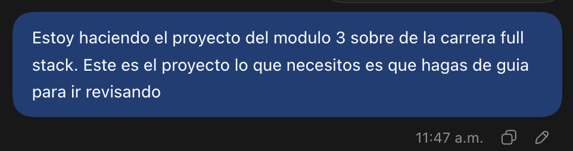
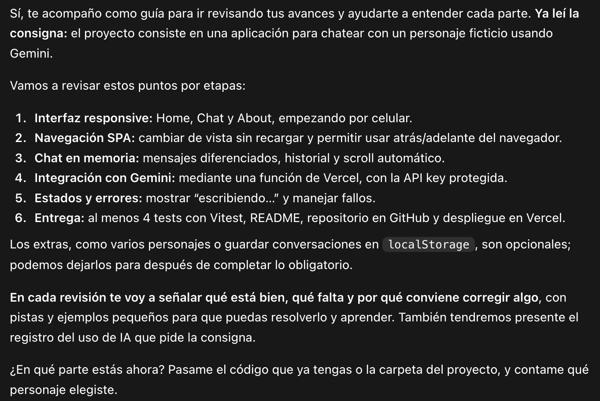
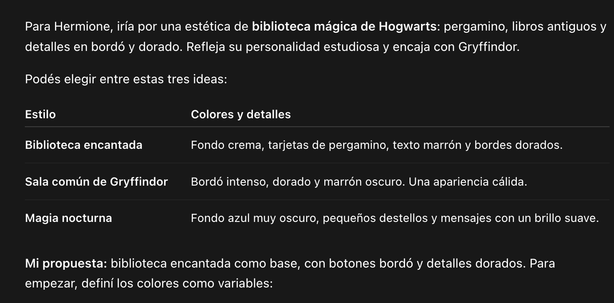
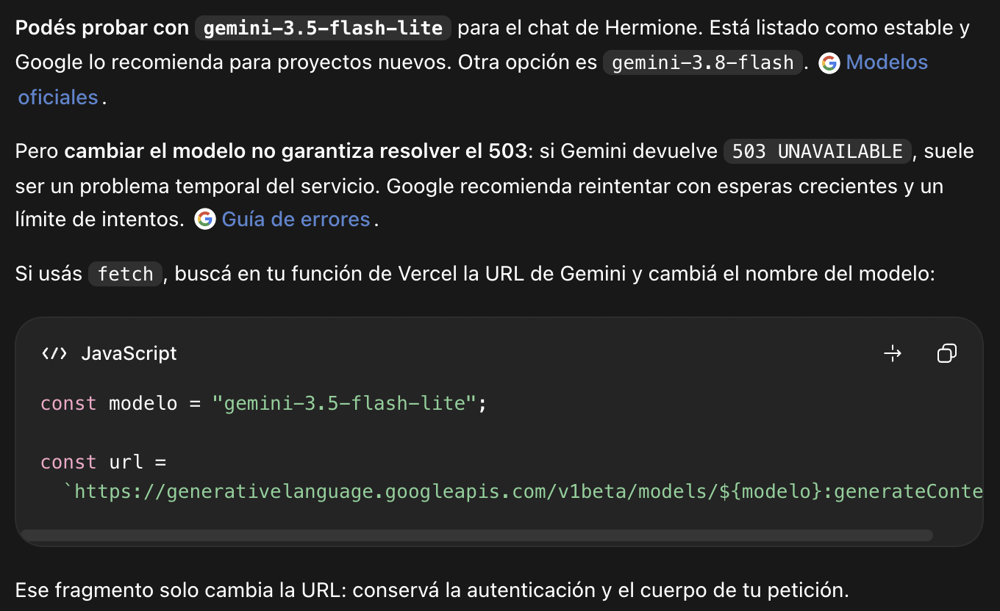

# Charlá con Hermione Granger

## Descripción del personaje elegido

Hermione Granger es un personaje del universo de Harry Potter que se destaca por su inteligencia, curiosidad, dedicación al estudio y lealtad a sus amigos. La aplicación interpreta su personalidad mediante Gemini, con respuestas breves en español y referencias a Hogwarts.

## Link a la aplicación desplegada

[Abrir la aplicación](https://proyectom3-aldanacarmuega.vercel.app)

## Requisitos y pasos para ejecutar localmente

Se necesita Node.js, npm, una cuenta de Vercel y una API key de Gemini con acceso y cuota para el modelo configurado. El entorno utilizado fue Node.js 24.18.0 y npm 11.16.0.

1. Clonar el repositorio y entrar en la carpeta:

```bash
git clone https://github.com/carmuegaaldana/ProyectoM3-CarmuegaAldana.git
cd ProyectoM3-CarmuegaAldana
```
2. Instalar las dependencias:

```bash
npm install
```

3. Crear `.env` a partir de `.env.example`, si todavía no existe:

```bash
cp -n .env.example .env
```

4. Completar `.env` con la clave personal y el modelo:

```dotenv
GEMINI_API_KEY=tu_clave_personal
GEMINI_MODEL=gemini-3.5-flash-lite
```

La clave real se guarda solo en `.env`, que está excluido de Git. `.env.example` debe permanecer sin credenciales.

5. Iniciar sesión en Vercel:

```bash
npx vercel login
```

6. Ejecutar la aplicación y las funciones del servidor:

```bash
npx vercel dev
```

En la primera ejecución, vincular la carpeta con un proyecto propio de Vercel, aceptar la raíz `./` y mantener la configuración de `vercel.json`. Abrir la dirección que aparece junto a `Ready!`, normalmente `http://localhost:3000`.

Mantener la terminal abierta mientras se usa la aplicación. Para detenerla, presionar Control + C. Reiniciar el servidor después de cambiar `.env`. `npm run dev` ejecuta únicamente el frontend; para probar Gemini se utiliza `npx vercel dev`.

## Cómo ejecutar tests

Desde la raíz del proyecto:

```bash
npm test
```

Los cinco tests de `tests/functions.test.js` comprueban mensajes vacíos, extracción de respuestas, envío del historial, error 503 y respuestas sin texto. Usan `fetch` simulado y variables ficticias, sin consumir la API. Los cinco tests pasaron. También se comprobó el chat con Gemini real en la aplicación desplegada.

## Cómo desplegar a Vercel

1. Subir el proyecto a un repositorio de GitHub sin incluir `.env`.
2. En Vercel, importar el repositorio y seleccionar la raíz `./`.
3. Mantener las opciones de `vercel.json`: preset Vite, Build Command `npm run build` y Output Directory `dist`.
4. Agregar las variables `GEMINI_API_KEY` y `GEMINI_MODEL` en el entorno de producción de Vercel. No usar el prefijo `VITE_` para la clave.
5. Desplegar la aplicación.
6. Probar `/home`, `/chat` y `/about`, incluyendo recargas directas, navegación atrás/adelante y una conversación real de varios turnos.
7. Si se modifican variables de entorno, realizar un nuevo despliegue.

Para desplegar desde la terminal, después de iniciar sesión y vincular el proyecto con Vercel, ejecutar:

```bash
npx vercel --prod
```

La aplicación se publicó el 30 de septiembre de 2026. Se verificaron las vistas, las recargas y una conversación real con Gemini, incluyendo el recuerdo del nombre y del tema de estudio durante la sesión. El historial se mantiene en memoria y se reinicia al recargar la aplicación.

## Capturas de pantalla de la aplicación funcionando

Capturas de la aplicación publicada en Vercel, tomadas el 30 de septiembre de 2026.

**Inicio**


**Chat con una respuesta real de Gemini**


**Chat en pantalla móvil (390 × 844)**


**Acerca del proyecto**


## Registro del uso de AI en el proyecto

Se utilizó ChatGPT/Codex como apoyo para revisar la consigna, proponer ideas de diseño y diagnosticar problemas con Gemini. A continuación se documentan tres consultas, cada una con una captura de la pregunta y otra de la respuesta.

1. **Guía para revisar el proyecto**

   > Estoy haciendo el proyecto del modulo 3 sobre de la carrera full stack. Este es el proyecto lo que necesitos es que hagas de guia para ir revisando

   La respuesta organizó la revisión por etapas: interfaz responsive, navegación SPA, chat en memoria, integración segura con Gemini, estados y errores, tests y entrega. Sirvió como guía para priorizar los requisitos obligatorios antes de los extras.

   **Captura del prompt**

   

   **Captura de la respuesta**

   

2. **Ideas de CSS para el personaje**

   > Necesito ayuda con el Css, dame ideas de estilos para que sea orientado al personaje hermione granger y tenga un estilo magico

   La respuesta propuso tres estilos: biblioteca encantada, sala común de Gryffindor y magia nocturna. Estas ideas sirvieron como referencia para relacionar la apariencia con Hermione y Hogwarts. El diseño final utiliza tonos oscuros, bordó y dorado, adaptados mediante CSS a distintos tamaños de pantalla.

   **Captura del prompt**

   

   **Captura de la respuesta**

   

3. **Consulta por el error 503 de Gemini**

   > tengo un error 503 con gemini, que otra version puedo usar para que funcione

   La respuesta sugirió probar `gemini-3.5-flash-lite` y aclaró que cambiar de modelo no garantiza resolver un error 503. Mostró cómo cambiar el modelo en la URL de la petición. En el proyecto, el modelo se configura mediante la variable de entorno `GEMINI_MODEL`; se utilizó `gemini-3.5-flash-lite` y se comprobó una respuesta real del chat en la aplicación desplegada.

   **Captura del prompt**

   

   **Captura de la respuesta**

   

Las sugerencias de AI se revisaron y adaptaron a la consigna, manteniendo HTML, CSS y JavaScript vanilla. La clave de Gemini se conserva en el servidor mediante variables de entorno y no se incluye en el frontend ni en el repositorio.

## Mejoras futuras

Estas propuestas no están implementadas en la versión actual y podrían incorporarse en próximas versiones:

- **Guardar conversaciones:** permitir conservar el historial en `localStorage` para recuperarlo al recargar, con un indicador de historial guardado y un botón para borrarlo.
- **Elegir otros personajes:** agregar una galería con personajes de Hogwarts, cada uno con su propia personalidad e instrucciones para Gemini.
- **Modo claro y oscuro:** ofrecer un selector entre una apariencia de pergamino claro y el estilo oscuro actual.
- **Más opciones en los mensajes:** mostrar la hora de envío y permitir copiar las respuestas de Hermione al portapapeles.
- **Reintentos automáticos controlados:** ante errores temporales de Gemini, incorporar esperas crecientes y un límite de intentos, informando al usuario del estado de la solicitud.
